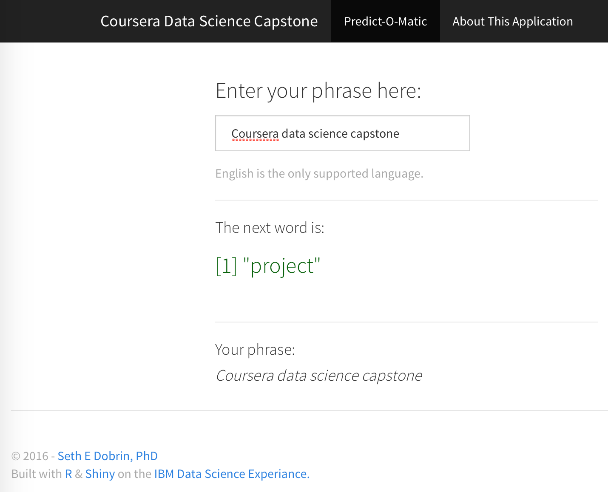

# Coursera Data Science Capstone Project:     
# The Predict-O-Matic    

Seth E Dobrin, PhD    
19 July 2016    

## Introduction

This project represnts the culmination of learnings from the [Coursera Data Science Specialization](https://www.coursera.org/specializations/jhu-data-science). An R-based MOOC consisting of 9 courses and a capstone project which is represented here.   

The output of this project is an R-Shiny web application called the [Predict-O-Matic](https://dr-seth.shinyapps.io/shinyApp/).    

This application was created using [R](http://www.r-project.org/) & [Shiny](http://shiny.rstudio.com) on the [IBM Data Science Experience](http://datascience.ibm.com)   

## Objective

The objective of this project is to build a Shiny app that allows users to enter a word or phrase and then predict the next word. The data set used is from [HC Corpora](http://www.corpora.heliohost.org/). This corpora consists of blogs, news feeds and twitter feeds and is availible in multiple language. However, for this project only English was used.   

All the data processing and predictions were done with well known natural language processing packages already developed for R

## Methods

After creating a data sample from the HC Corpora data, this sample was cleaned.   

Data Cleaning:    
- Convert all text to lower case     
- Remove numers, links & special characters.     

Data Processing:    
- Tokenize into contiguous blocks of words known as n-grams.     
- Created unigrams, bigrams, trigrams and quadgrams      
- Create dictionary of aggregated and frequency matricies    

## Using the Predict-O-Matic Application

The resulting Shiny app allows a user to enter a pharse in english and have the next word in the phrase predicted. 

## Discussion & Additonal Information 

Performing natural language processing of a large data set like the one use in this project is computationally  intensive. In order to complete this project several approaches were taken. these included:     

- Sampling the data set instead of reading in everything    
- Utilizing multiple cores thru parallelization    
- Tuneing the model and pre-running the data processing    
- Model building in seperate script then referencing the output from the Shiny app    

